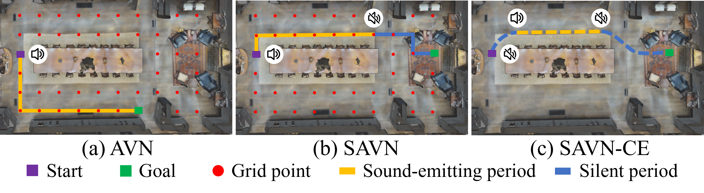
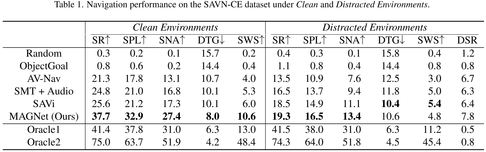

<div align="center">
<h2>
  [CVPR 2026] Semantic Audio-Visual Navigation in Continuous Environments
</h2>

<p align="center">
  <a href='https://scholar.google.com/citations?hl=en&user=-X6SeMIAAAAJ' target="_blank">Yichen Zeng</a>, 
  <a href='https://scholar.google.com/citations?hl=en&user=OXks3skAAAAJ' target="_blank">Hebaixu Wang</a>,
  <a href='https://scholar.google.com/citations?hl=en&user=tI_cTV8AAAAJ' target="_blank">Meng Liu</a>,
  <a href='https://scholar.google.com/citations?hl=en&user=FNfBHg8AAAAJ' target="_blank">Yu Zhou</a>,
  <a href='https://scholar.google.com/citations?hl=en&user=6esEV50AAAAJ' target="_blank">Kehan Chen</a>,
  <a href='https://scholar.google.com/citations?hl=en&user=Af60_cEAAAAJ' target="_blank">Chen Gao</a>,
  <a href='https://scholar.google.com/citations?hl=en&user=a3x1k7kAAAAJ' target="_blank">Gongping Huang</a>
</p>
</div>

<p align="center">
  <a href="#">
    
  </a>
  <a href="https://github.com/bjzgcai">
    
  </a>
</p>

## Motivation
Audio-visual navigation enables embodied agents to navigate toward sound-emitting targets by leveraging both auditory and visual cues.
However, most existing approaches depend on precomputed room impulse responses (RIRs) for binaural audio rendering, restricting agents to discrete grid positions and leading to spatially discontinuous observations.

<p align="center"></p>

To establish a more realistic setting, we introduce Semantic Audio-Visual Navigation in Continuous Environments (SAVN-CE), where agents can move freely in 3D spaces and perceive temporally and spatially coherent audio-visual streams.
In this setting, targets may intermittently become silent or stop emitting sound entirely, causing agents to lose goal information.
To tackle this challenge, we propose MAGNet, a multimodal transformer-based model that jointly encodes spatial and semantic goal representations and integrates historical context with self-motion cues to enable memory-augmented goal reasoning.

<p align="center"></p>

Comprehensive experiments demonstrate that MAGNet significantly outperforms state-of-the-art methods, achieving up to a **12.1\%** absolute improvement in success rate.
These results also highlight its robustness to short-duration sounds and long-distance navigation scenarios.

<p align="center"></p>

## Installation

Follow the [installation guide](INSTALLATION.md) to set up the environment and prepare data.

## Usage

This repository provides audio-visual observation rendering in continuous environments and supports semantic audio-visual embodied navigation task. 
We extend existing audio-visual navigation methods, including `AV-Nav` and `SAVi`, into continuous environments and introduce our proposed method, `MAGNet`.

Below are example commands for training and evaluating `MAGNet` on Matterport3D. Scripts for running all methods can be found in `pretraining.sh`, `eval.sh`, `train.sh`, and `test.sh`.

### 1. Pretraining

```bash
CUDA_VISIBLE_DEVICES=0,1,2,3 \
torchrun \
    --nproc_per_node 4 \
    savnce_baselines/magnet/run.py \
    --run-type train \
    --exp-config savnce_baselines/magnet/config/mp3d/rgbd_ddppo_clean_pretraining.yaml \
    --model-dir data/models/savnce_pretraining/magnet
```

### 2. Validation

Evaluate every 2 checkpoints and generate a validation curve:

```bash
python \
    savnce_baselines/magnet/run.py \
    --run-type eval \
    --exp-config savnce_baselines/magnet/config/mp3d/rgbd_ddppo_clean_pretraining.yaml \
    --model-dir data/models/savnce/magnet \
    --prev-ckpt-ind 0 \
    --eval-interval 2
```
Select the checkpoint achieving the highest SPL on the validation split for training.
### 3. Training

```bash
CUDA_VISIBLE_DEVICES=0,1,2,3 \
torchrun \
    --nproc_per_node 4 \
    savnce_baselines/magnet/run.py \
    --run-type train \
    --exp-config savnce_baselines/magnet/config/mp3d/rgbd_ddppo_clean.yaml \
    --model-dir data/models/savnce/magnet \
    RL.DDPPO.pretrained True \
    RL.DDPPO.pretrained_weights data/models/savnce_pretraining/magnet/data/ckpt.xxx.pth
```

### 4. Testing

Evaluate training checkpoints and test the best-performing model on the validation split:

```bash
python \
    savnce_baselines/magnet/run.py \
    --run-type test \
    --exp-config savnce_baselines/magnet/config/mp3d/rgbd_ddppo_clean.yaml \
    --model-dir data/models/savnce/magnet \
    --eval-best \
    EVAL.SPLIT test
```
To test a specific checkpoint: replace `--eval-best` with `EVAL_CKPT_PATH_DIR data/models/savnce/magnet/data/ckpt.xxx.pth`.
### 5. Generate demo video

```bash
python \
    savnce_baselines/magnet/run.py \
    --run-type test \
    --exp-config savnce_baselines/magnet/config/mp3d/rgbd_ddppo_clean.yaml \
    --model-dir data/models/savnce/magnet \
    EVAL_CKPT_PATH_DIR data/pretrained_ckpts/magnet/magnet_clean.pth \
    RL.PPO.GOAL_DESCRIPTOR.use_pretrained False \
    RL.PPO.SCENE_MEMORY_TRANSFORMER.use_pretrained False \
    RL.DDPPO.pretrained False \
    EVAL.SPLIT test \
    TEST_EPISODE_COUNT 5 \
    VIDEO_OPTION [\"disk\"] \
    VISUALIZATION_OPTION [\"top_down_map\"] \
    TASK_CONFIG.TASK.SENSORS [\"BINAURAL_FEATURE_EXTRACTOR\",\"POSE_SENSOR\",\"AUDIOGOAL_SENSOR\",\"GOAL_DESCRIPTOR_SENSOR\",\"ORACLE_ACCDDOA_SENSOR\"] \
    TASK_CONFIG.SIMULATOR.TYPE "SAVNCE_Simulator" \
    DISPLAY_RESOLUTION 1024
```
Demos are provided in `assets/demos`. Please refer to the supplementary material for detailed descriptions.

## Tips

**1.** All learning-based approaches are trained for up to 240M steps, with early stopping applied when no improvement is observed on the validation split for 24M consecutive steps.  
The total number of update steps is computed as: $N_{steps} = N_{GPU} * N_{env/GPU} * N_{update} * N_{steps/update}$.  
We use 4 GPUs, 10 parallel environments per GPU, a maximum 40,000 update steps and 150 steps per update, resulting in a maximum of 240M steps.

**2.** Due to the high computational cost of binaural audio rendering, simulation speed is strongly dependent on CPU resources.

Tested on servers with:
- dual Intel(R) Xeon(R) Platinum 8378A CPUs (64 cores/128 threads),
- four NVIDIA A800-SXM4-40GB GPUs.

Performance:
- ~200 fps under *Clean Environments* → ~14 days for the full 240M steps.
- ~120 fps under *Distracted Environments* →  ~23 days for the full 240M steps.

Training and evaluation are performed concurrently.  
If the validation performance does not improve for 24M consecutive steps, training is terminated early; otherwise, be patient until it converges.  
In total, completing all training and evaluation processes (including our method and the baselines) takes more than two months using two such servers.

**3.** If a CUDA out-of-memory (OOM) error occurs during training:
- reduce the number of parallel environments per GPU (`NUM_PROCESSES`), or
- reduce the mini-batch size (`num_mini_batch`).

Ensure that `NUM_PROCESSES` is divisible by `num_mini_batch`. 

## Acknowledgement

This project builds upon [Habitat-Sim](https://github.com/facebookresearch/habitat-sim), [Habitat-Lab](https://github.com/facebookresearch/habitat-lab) and [SoundSpaces](https://github.com/facebookresearch/sound-spaces). We extend these frameworks to support semantic audio-visual navigation in continuous environments. Portions of the implementation of `MAGNet` are adapted from the official code [DCASE2024 SELD Baseline](https://github.com/partha2409/DCASE2024_seld_baseline) and [ENMus](https://github.com/ZhanboShiAI/ENMuS). We sincerely thank the original authors for making their work publicly available.

## Citation

If you use `SAVN-CE` or `MAGNet` in your research, please cite our [paper]():

```
@inproceedings{zeng26semantic,
  title     = {Semantic Audio-Visual Navigation in Continuous Environments},
  author    = {Zeng, Yichen and Wanghe, Baixu and Liu, Meng and Zhou, Yu and Chen, Kehan and Gao, Chen and Huang, Gongping},
  booktitle = {IEEE/CVF Conference on Computer Vision and Pattern Recognition (CVPR)},
  year      = {2026}
}
```

If you use any of the 3D scene assets ([MatterPort3D](https://niessner.github.io/Matterport/), [Replica](https://github.com/facebookresearch/Replica-Dataset), [HM3D](https://aihabitat.org/datasets/hm3d/), [Gibson](http://gibsonenv.stanford.edu/database/), etc.), please cite the corresponding dataset papers as well.

## License

SAVN-CE is released under [CC-BY-4.0](https://creativecommons.org/licenses/by/4.0/), as found in the [LICENSE](LICENSE) file.

Trained models and task datasets are considered data derived from the corresponding scene datasets.
- Matterport3D based task datasets and trained models are distributed with [Matterport3D Terms of Use](http://kaldir.vc.in.tum.de/matterport/MP_TOS.pdf) and under [CC BY-NC-SA 3.0 US license](https://creativecommons.org/licenses/by-nc-sa/3.0/us/).
